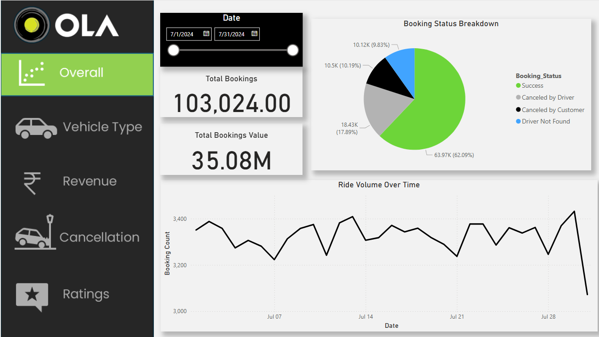
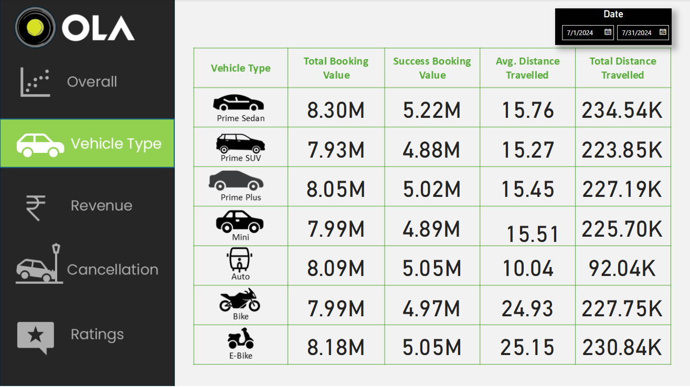
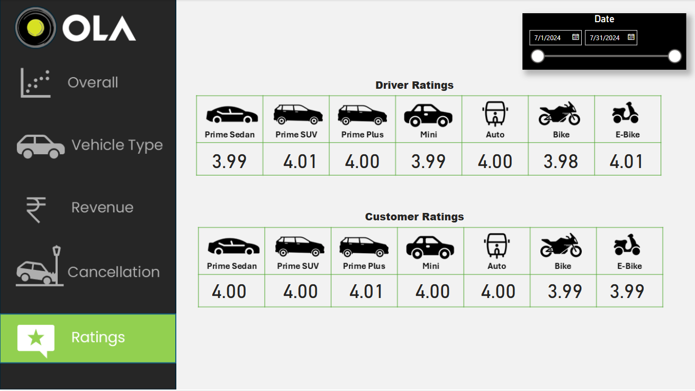
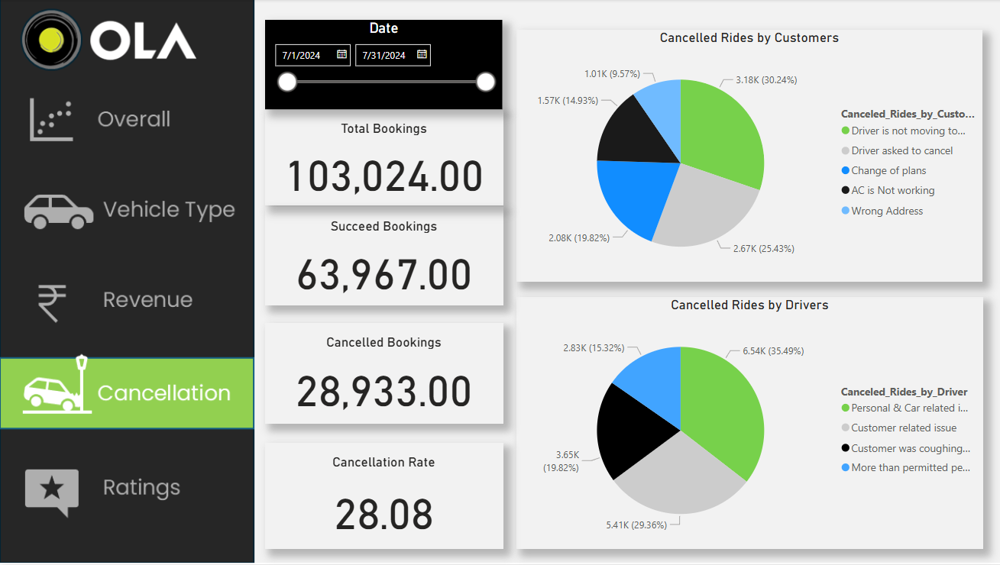
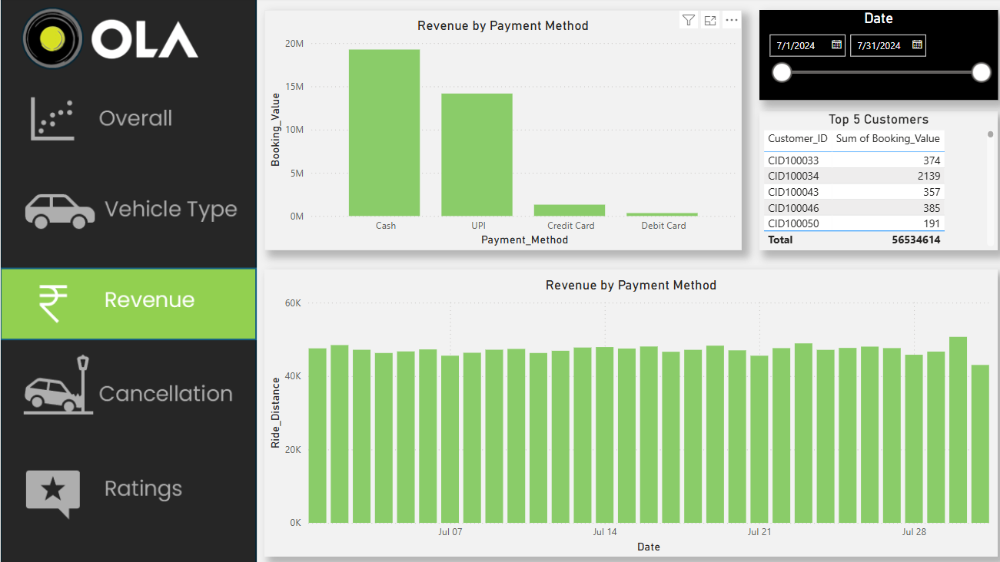

# 🚗 Ola Data Analytics Project

This project is an end-to-end data analytics solution focused on Ola ride data, utilizing a dataset of over 100,000 records. The aim was to extract actionable insights and visualize key performance metrics using SQL, Excel, and Power BI.

## 📊 Tech Stack
- **Power BI** – For data visualization and interactive dashboards
- **MySQL** – For data extraction, transformation, and manipulation
- **Microsoft Excel** – For preliminary data cleaning and analysis

## 📌 Project Description
The **Ola Data Analytics** project demonstrates the full data analytics pipeline, from data preparation to insightful dashboards. 

### Key Highlights:
- Extracted, cleaned, and transformed over 100,000 records for analysis.
- Developed and executed optimized **SQL queries** to manipulate, filter, and aggregate data.
- Utilized **Excel** for initial data exploration, validation, and formatting.
- Built fully interactive **Power BI dashboards** to visualize key metrics such as:
  - Ride volume trends
  - Peak hour analysis
  - Revenue and fare breakdown
  - Driver and customer performance metrics
  - Location-wise demand distribution

## 📷 Sample Dashboards

## 🚀 Getting Started

### Prerequisites
- MySQL
- Microsoft Excel
- Power BI Desktop

